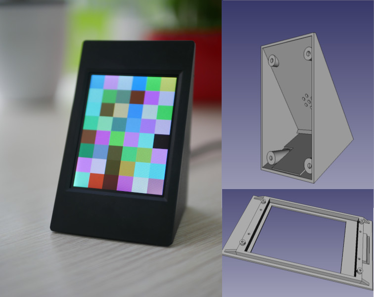

This is a simple efficient design if you are looking for an enclosure for IoT project if it needs a 3.2 TFT LCD and a USB port. To open the project you need to download [FreeCAD](https://www.freecadweb.org/).
You can simply use a 3D printer to print it out.
